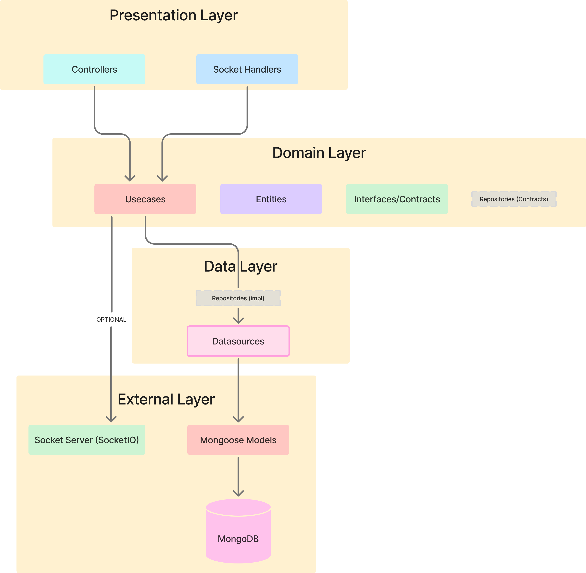
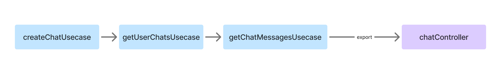

# Chat Node App

Aplicação de chat em tempo real desenvolvida com Node.js, Express, Socket.IO e MongoDB.

## Arquitetura do Projeto

Este projeto segue uma **arquitetura em camadas inspirada na Clean Architecture**, organizada por features. É uma aplicação de chat em tempo real usando Express.js, Socket.IO e MongoDB.

## Decisão Arquitetural: Usecase → Datasource

Este projeto adota uma abordagem simplificada onde o **usecase chama o datasource diretamente**, sem uma camada de Repository intermediária por não necessitar combinar múltiplos datasources:

Abordagem Utilizada (Simplificada):
Usecase → Datasource → MongoDB

Abordagem Completa (Clean Arch)        
Usecase → Repository → Datasource → DB


### Vantagens desta escolha:

- Menos boilerplate para projeto pequeno/médio
- Menos arquivos para manter
- Datasource já é uma interface, permitindo mock em testes

### Quando adicionar Repository:

- Quando precisar combinar múltiplos datasources
- Quando houver lógica de mapeamento complexa entre entidades e models
- Se precisar cachear resultados
- Se o projeto crescer significativamente

---

### Estrutura de Camadas



### 1. Presentation Layer (`presenter/controllers/`)

Controllers recebem as requisições HTTP e retornam respostas formatadas. Eles apenas orquestram chamadas aos usecases, sem lógica de negócio.

```typescript
// Exemplo: ChatController chama CreateChatUsecase
// Não contém lógica de negócio, apenas coordenação
```

### 2. Domain Layer (`domain/`)

Contém o coração da aplicação:

| Subpasta | Propósito |
|----------|-----------|
| `entities/` | Interfaces que definem a estrutura dos dados |
| `usecases/` | Interfaces/contracts que definem as operações de negócio |
| `usecases/impl/` | Implementações concretas dos usecases |
| `models/` | Schemas do Mongoose |
| `errors/` | Classes de erro personalizados do domínio |
| --- | --- |
| `repositories/` | Interfaces/contracts dos repositories (NÃO FEITO NESSE PROJETO) |

### 3. Data Layer (`data/datasources/`)

Responsável pela persistência de dados:

| Subpasta | Propósito |
|----------|-----------|
| `datasources/` | Interfaces/contracts dos datasources |
| `datasources/impl/` | Implementações concretas que acessam MongoDB |
| --- | --- |
| `repositories/` | Implementações dos repositories, orquestrando múltiplos datasources (NÃO FEITO NESSE PROJETO) |

### 4. External Layer (`core/external/`)

Infraestrutura e integrações externas:

| Componente | Propósito |
|------------|-----------|
| `database/` | Conexão com MongoDB e classe base para datasources |
| `websocket/` | Configuração do Socket.IO |
| `websocket/socketEmitter` | Interface para emissão de eventos |
| `websocket/socketEmitterImpl` | Implementação concreta do emitter |

---

## Dependency Injection (DI)

A injeção de dependências é feita manualmente nos arquivos `index.ts` de cada feature:



**Exemplo no `src/features/chat/index.ts`:**

```typescript
const sendMessageUsecase = new SendMessageUsecaseImpl(
    saveMessageDatasource,
    findUserByIdDatasource,
    socketEmitter,
    updateChatDatasource,
    findChatByRoomUsecase
);
```

---

## Estrutura de Pastas

```
src/
├── core/
│   ├── config/           # Configurações e rotas
│   ├── const/            # Constantes (nomes de coleções, tokens)
│   ├── entities/         # Entidades genéricas
│   ├── errors/           # Classes de erro base e failures compartilhados
│   ├── external/         # Infraestrutura externa
│   │   ├── database/     # Conexão MongoDB
│   │   └── websocket/    # Socket.IO
│   ├── middlewares/      # Middlewares Express
│   └── utils/            # Utilitários
│
├── features/
│   ├── auth/
│   │   ├── data/datasources/
│   │   ├── domain/
│   │   │   ├── entities/
│   │   │   ├── errors/
│   │   │   └── usecases/
│   │   └── presenter/controllers/
│   │
│   ├── chat/
│   │   ├── data/datasources/
│   │   ├── domain/
│   │   │   ├── entities/
│   │   │   ├── errors/
│   │   │   ├── models/
│   │   │   └── usecases/
│   │   └── presenter/controllers/
│   │
│   └── user/
│       ├── data/datasources/
│       ├── domain/
│       │   ├── entities/
│       │   ├── errors/
│       │   ├── models/
│       │   └── usecases/
│       └── presenter/controllers/
│
└── server.ts             # Entry point da aplicação
```

---

## Componentes Importantes

| Componente | Descrição |
|------------|-----------|
| `Failure` | Classe base para tratamento padronizado de erros |
| `BaseMongoDbDatasource` | Classe abstrata com operações CRUD comuns |
| `SocketSessionManager` | Gerencia mapeamento userId → socketId |
| `authMiddleware` | Valida JWT nas rotas protegidas |

---

## Rotas da API

| Método | Endpoint | Descrição | Autenticação |
|--------|----------|-----------|--------------|
| POST | `/login` | Autentica usuário | ❌ |
| POST | `/register` | Cadastra novo usuário | ❌ |
| GET | `/find-user/:email` | Busca usuário por email | ✅ |
| GET | `/check-user-online/:userId` | Verifica se usuário está online | ✅ |
| POST | `/create-chat` | Cria novo chat | ✅ |
| GET | `/user-chats/:userId` | Lista chats do usuário | ✅ |
| GET | `/get-messages/:chatId` | Lista mensagens de um chat | ✅ |

---

## Eventos Socket.IO

| Evento | Descrição |
|--------|-----------|
| `connection` | Nova conexão estabelecida |
| `join_room` | Usuário entra em uma sala |
| `send_message` | Usuário envia uma mensagem |
| `receive_message` | Mensagem recebida por outros usuários |
| `new_message_notification` | Notificação de nova mensagem |
| `chat_created` | Novo chat foi criado |
| `user_status_changed` | Status online/offline do usuário mudou |

---

## Quick Start

### Pré-requisitos

- Node.js (v18+)
- Docker e Docker Compose

### Passo a passo

1. **Instale as dependências:**

```bash
npm install
```

2. **Inicie o container Docker com MongoDB:**

```bash
docker-compose up -d
```

Isso irá criar um container `mongodb_ixc_chat` rodando na porta `27017` com as credenciais:
- **Username:** `root`
- **Password:** `password`

3. **Inicie o servidor:**

```bash
npm run dev
```

O servidor estará disponível em: `http://localhost:8000`

### Scripts Disponíveis

| Comando | Descrição |
|---------|-----------|
| `npm run dev` | Inicia o servidor em modo desenvolvimento (com hot-reload) |
| `npm start` | Compila TypeScript e inicia o servidor em modo produção |
| `npm run build` | Compila o código TypeScript para JavaScript |
| `npm run lint` | Executa o linter |
| `npm run lint:fix` | Executa o linter e corrige problemas automaticamente |
